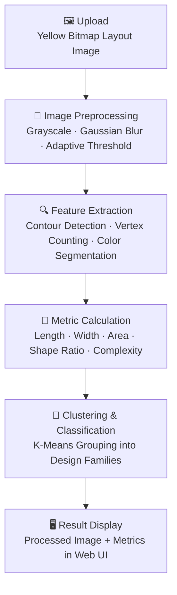

<div align="center">

# 🏗️ Architectural Design Optimization
### Image Processing Pipeline for Classifying Building Layouts

*A Flask-based tool that extracts geometric features from building-layout bitmaps and classifies them by shape family and complexity — turning raw floor-plan images into structured, comparable design data.*

<br/>


<br/>

**[🎥 Demo Video](#-demo-video) · [✨ Features](#-features) · [🧭 Workflow](#-workflow) · [⚙️ Installation](#️-installation-and-setup) · [🧰 Tech Stack](#-technologies-used)**

</div>

---

## 📌 Overview

This project is an **image processing pipeline** designed to accurately classify bitmap images of building layouts by extracting key geometric features. It's a web-based application built with **Flask** that lets a user upload an image of a yellow bitmap floor plan, which is then processed to calculate several key metrics:

| Metric | Description |
|---|---|
| 📏 **Length** | Layout length, in cm |
| 📐 **Width** | Layout width, in cm |
| 🔲 **Area** | Layout area, in cm² |
| ⚖️ **Shape Ratio** | Width ÷ Length |
| 🧩 **Complexity** | Structural complexity classification |

The processed image and its extracted metrics are displayed back to the user through a clean, responsive web interface.

<div align="center">


</div>

---

## 🎥 Demo Video

<div align="center">

A full walkthrough of the tool in action — image upload, processing, and metric output:


https://github.com/user-attachments/assets/b6996861-3dfb-4103-ba4f-468bcef9fd85


</div>

> 💡 **Tip:** GitHub-hosted `.mp4` demos (dragged directly into the README editor) render as inline, playable videos on the repo page — no external host needed.

---

## ✨ Features

- 🧠 **Feature Extraction** — Extracts key geometric features from building layout images using classical image-processing techniques.
- 🎨 **Color Thresholding** — Identifies key regions in the layout by segmenting the image based on color intensity (targets the yellow bitmap regions).
- 🔺 **Vertex Counting** — Determines the structural complexity of a layout by counting significant vertices via polygon approximation.
- 🖊️ **Contour Detection** — Detects and analyzes the shapes and structures within the building layout.
- 🧮 **K-Means Clustering** — Groups layouts into similar design "families" based on extracted features, enabling efficient classification and comparison across many designs.
- 🌐 **Web Upload Interface** — Upload images directly through the browser — no local script-running required.
- 🖼️ **Visual Metric Display** — Processed images are shown alongside their computed metrics in a modern, responsive UI.
- 📱 **Responsive Design** — Works cleanly across desktop and mobile devices.

---

## 🗂️ Project Structure

```
Architectural-Design-Optimization/
│
├── app.py                    # Flask application entry point (upload → process → render)
├── image_processing.py       # Core CV logic: metric calculation & complexity classification
├── templates/                 # HTML templates (Flask/Jinja2)
├── static/uploads/           # Uploaded images are stored here
├── Cluster_1/ Cluster_2/ Cluster_3/   # Layout clusters grouped by K-Means
├── E7-images/                 # Reference / sample layout images
├── bounding_box_data.csv      # Extracted bounding-box metrics per layout
├── edge_pixel_data.csv        # Edge-pixel level data
├── edge_pixel_counts.csv      # Aggregated edge-pixel counts
├── image_labels.csv           # Cluster/family labels per image
├── length_plot.png            # Distribution plot — layout length
├── width_plot.png             # Distribution plot — layout width
├── area_plot.png              # Distribution plot — layout area
├── complexity_plot.png        # Distribution plot — layout complexity
├── main.ipynb                  # Exploratory notebook — clustering & analysis
├── Presentation.pdf            # Project presentation deck
└── README.md                   # You are here
```

---

## 🧭 Workflow



<details>
<summary><b>🧹 1. Image Preprocessing</b> (click to expand)</summary>
<br/>

- Convert the uploaded image to grayscale.
- Apply Gaussian blurring to reduce noise.
- Use adaptive thresholding to highlight key structures.

</details>

<details>
<summary><b>🔍 2. Feature Extraction</b> (click to expand)</summary>
<br/>

- Detect contours and extract their geometric properties.
- Count vertices using polygon approximation to gauge shape complexity.
- Perform color segmentation to isolate and identify key layout regions.

</details>

<details>
<summary><b>🧮 3. Clustering & Classification</b> (click to expand)</summary>
<br/>

- Use **K-Means clustering** to group layouts into distinct design families.
- Assign labels to images based on similarity of extracted feature vectors.

</details>

<details>
<summary><b>🖥️ 4. Web Application Flow</b> (click to expand)</summary>
<br/>

- User uploads a `.png` / `.jpg` / `.jpeg` layout image via the homepage form.
- Flask validates and securely saves the file to `static/uploads/`.
- `image_processing.py` computes length, width, area, shape ratio, and complexity.
- Results render back to the user alongside the processed image.

</details>

---

## 🧰 Technologies Used

<div align="center">

| Category | Tools |
|---|---|
| **Backend / Web Server** | Python, Flask |
| **Image Processing** | OpenCV |
| **Numerical Computing** | NumPy |
| **Data Handling** | pandas |
| **Visualization** | Matplotlib |
| **Clustering / ML** | scikit-learn (K-Means) |
| **Frontend** | HTML / CSS |

</div>

---

## ⚙️ Installation and Setup

### Prerequisites

Ensure that you have the following dependencies installed:

- Python 3.x
- OpenCV
- NumPy
- Matplotlib
- Scikit-learn
- Flask

### Clone the Repository

```bash
git clone https://github.com/NEC0S/Architectural-Design-Optimization.git
cd Architectural-Design-Optimization
```

### Install Dependencies

```bash
pip install flask opencv-python numpy matplotlib scikit-learn pandas werkzeug
```

### Run the Application

```bash
python app.py
```

Then open your browser to:

```
http://127.0.0.1:5000/
```

Upload a yellow bitmap building-layout image and view the extracted length, width, area, shape ratio, and complexity classification.

---

## 📊 Sample Outputs

The repo includes precomputed distribution plots from the underlying dataset:

| Plot | File |
|---|---|
| Length distribution | [`length_plot.png`](./length_plot.png) |
| Width distribution | [`width_plot.png`](./width_plot.png) |
| Area distribution | [`area_plot.png`](./area_plot.png) |
| Complexity distribution | [`complexity_plot.png`](./complexity_plot.png) |

Layouts are pre-grouped into clusters (`Cluster_1`, `Cluster_2`, `Cluster_3`) based on K-Means classification, with corresponding metrics tracked in `bounding_box_data.csv`, `edge_pixel_data.csv`, `edge_pixel_counts.csv`, and `image_labels.csv`.

---

## 🔮 Future Improvements

- [ ] Implement deep learning–based classification for improved accuracy.
- [ ] Add support for additional feature extraction methods.
- [ ] Optimize performance for large-scale datasets.
- [ ] Extend clustering to support dynamic, user-configurable cluster counts.
- [ ] Add batch-upload support for processing multiple layouts at once.

---

## 📑 Presentation

📄 **[`Presentation.pdf`](./Presentation.pdf)** — Full project presentation covering methodology, feature extraction, clustering approach, and results.

---

## 👤 About

<div align="center">

An image-processing pipeline for classifying and clustering architectural building layouts, built by **[NEC0S](https://github.com/NEC0S)**.

<br/>

*If you found this project useful, consider ⭐ starring the repository.*


</div>
